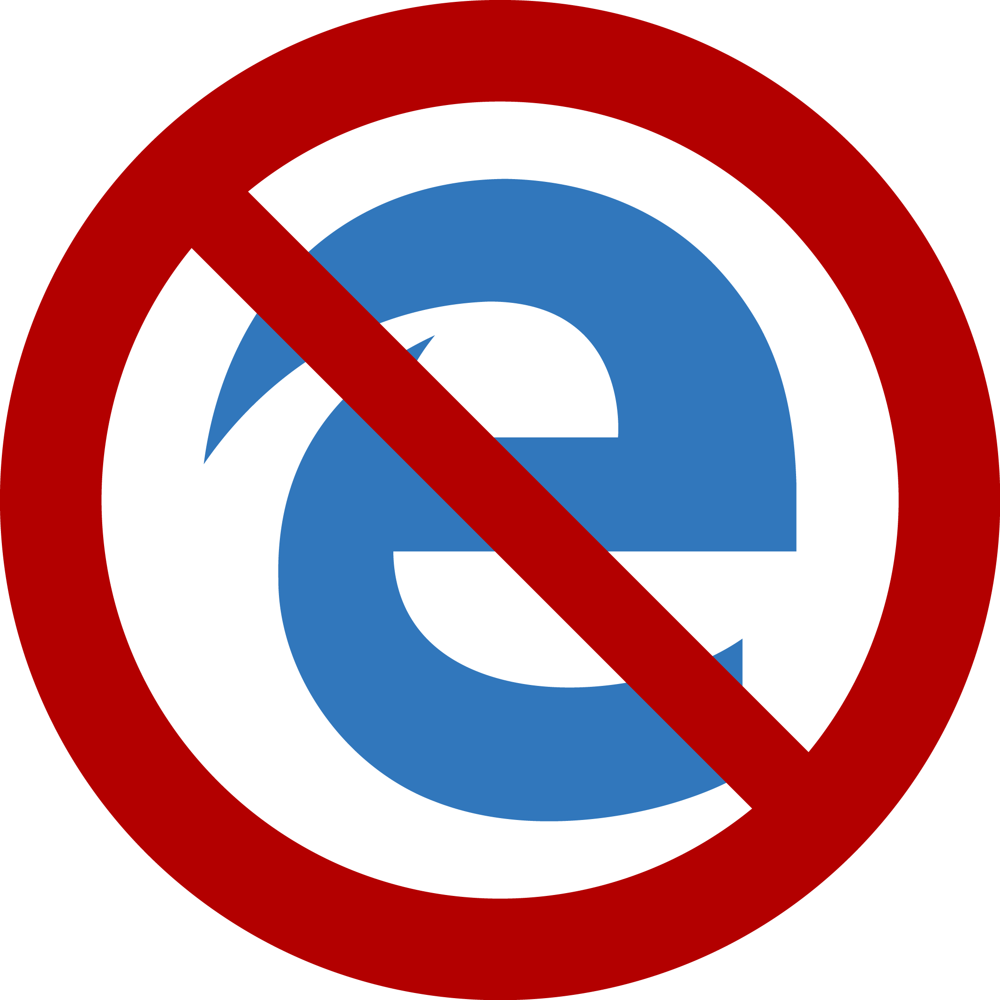

autoscale: true

# [fit] **IT** _**Best Practices**_

---

To help keep the office network secure and avoiding future attacks we need to do the following:

- Update the software we use
- Strengthen passwords
- Check for viruses
- Navigate networks responsibly
- Change the way we use Dropbox

---

# U P D A T E S

---

# **_Windows_** and **_Mac_**

It is important that your operating system is as up to date as possible. Security vulnerabilities are found and patched and made available through updates.

---

# **_Required_** Operating System Versions

## Windows:
- Windows 10 with Anniversary Update (version 1607, build 14393.10 or newer)

## Mac
- macOS Sierra (10.12)
- Mac OS X 10.11 (El Capitan)
- Mac OS X 10.10 (Yosemite)

---

# B R O W S E R S

---

_Google Chrome_ and _Firefox_ are the your best options for a secure browser. Both browsers will alert you when they need to be updated.

_Edge_ should be avoided whenever possible. It's not that good.

---

# B R O W S E R
# E X T E N S I O N S

---

- _HTTPS Everywhere_ is a _Firefox_, _Chrome_, and _Opera_ extension that encrypts your communications with many major websites, making your browsing more secure.

- _uBlock Origin_ is a browser extension for _Chrome_ and _Firefox_ for content-filtering, including ad-blocking. 

---

# _**Do Not Track**_
### _Optional_
Websites can collect and track your browsing data, which can be done for beneficial purposes like improving security but there is no way for a user to know how their data is being used. To enable _Do Not Track_, do the following:

---

# In _Chrome_:
  1. At the top right, click the three vertical dots and then **Settings**.
  2. At the bottom, click **Show advanced settings...**.
  3. Under "Privacy," make sure the checkbox next to **Send a "Do Not Track" request with your browsing traffic** is selected.

---

# In _Firefox_:
  1. Click the menu button and choose Preferences.
  2. Select the Privacy panel.
  3. Click **manage your Do Not Track settings**.
  4. Check **Use Do Not Track**.
  5. Close the _about:preferences_ page. Any changes you've made will automatically be saved.

---

# P A S S W O R D S

---

Soon staff will be required to password protect their work computers as well as any personal computers used for work purposes.

Email accounts will also be made more secure by enabling 2-step verification. This adds another layer of security to your email account by protecting it with your password and your phone.

Additionally, we will be requiring much stronger passwords to access the server. These passwords **_should not_** be used for any other account, either for work or personal use.

---

# **_Flash_ and _Java_**

_Adobe Flash_ and _Java_ should **_always_** be up to date. Windows will inform you when there is an update available for _Java_. _Flash_ will alert you through Windows when it needs to be updated.

**_Never_** click a browser pop-up, ad, or "warning" to update either _Flash_ or _Java_. You **_will_** compromise your computer.

---

# S A F E T Y
# O N L I N E

---

- Don't open files you don't recognize from addresses you don't know
- Don't download screensavers or other similar software onto your work computer
- Double check the URL of the site your visiting looks legitimate (eg. US government websites should have .gov in the address)
- If a site looks suspicious, a pop-up ad sounds too good to be true, it likely is. Close it and move on.
- If you're not sure about something, just ask

---

# A N T I V I R U S
# S O F T W A R E

---

For now, we're going to stick with **_Windows Defender_**. It will update is antivirus definitions on it's own, keeping itself up to date. You can schedule it to run regularly:

- Search for and open Schedule tasks.
- In the left pane, expand Task Scheduler Library > Microsoft > Windows, and then scroll down and double-click (or tap) the  Windows Defender folder.
- In the top center pane, double-click (or tap twice)  Windows Defender Scheduled Scan.
- In the Windows Defender Scheduled Scan Properties (Local Computer) window, select the Triggers tab, go to the bottom of the window, and then tap or click New.
- Specify how often you want scans to run and when you’d like them to start.

---

# D R O P B O X

---

# _**Drobpox**_

New policy regarding **_Dropbox_** use is currently being drafted for the US and India offices.

---

#**_Ending_ your session on the server**

Please sign out of _Windows_ when ending your session on the server instead of simply closing the _RDP window_ and disconnecting. When you disconnect your session it is still active and slows down the server.