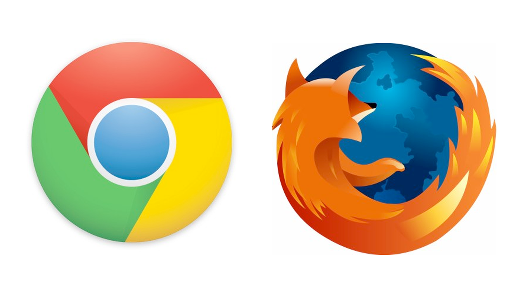

# **B R O W S E R S**

---

---

We love our users, we really do! Sometimes, when we get really excited
about something, we might forget to check whether what we do actually is
for them or for us.

---

# Preventing a ransomware attack  (taken from [The No More Ransom Project] (https://www.nomoreransom.org/prevention-advice.html))

1. **Back up** Have a recovery system in place so a ransomware infection can't destroy your personal data forever. It's best to create two back up copies: one to be stored in the cloud (remember to use a service that makes an automatic backup of your files) and one to store physically (portable hard drive, thumb drive, extra laptop, etc.). Disconnect these from your computer when you are done. Your back up copies will also come in handy should you accidentally delete a critical file or experience a hard drive failure.

2. **Use robust antivirus software** to protect your system from ransomware. Do not switch off the 'heuristic functions' as these help the solution to catch samples of ransomware that have not yet been formally detected.

3. **Keep all the software on your computer up to date.** When your operating system or applications release a new version, install it. And if the software offers the option of automatic updating, take it.

4. **Trust no one. Literally.** Any account can be compromised and malicious links can be sent from the accounts of friends on social media, colleagues or an online gaming partner. Never open attachments in emails from someone you don't know. Cybercriminals often distribute fake email messages that look very much like email notifications from an online store, a bank, the police, a court or a tax collection agency, luring recipients into clicking on a malicious link and releasing the malware into their system. This is called 'phishing'. When your operating system or applications release a new version, install it. And if the software offers the option of automatic updating, take it.

5. **Enable the 'Show file extensions' option in the Windows settings on your computer.** This will make it much easier to spot potentially malicious files. Stay away from file extensions like '.exe', '.vbs', and '.scr'. Scammers can use several extensions to disguise a malicious file as a video, photo, or document (like hot-chics.avi.exe or doc.scr).

6. **If you discover a rogue or unknown process on your machine,** disconnect it immediately from the internet or other network connections (such as home Wi-Fi) - this will prevent the infection from spreading.

---
